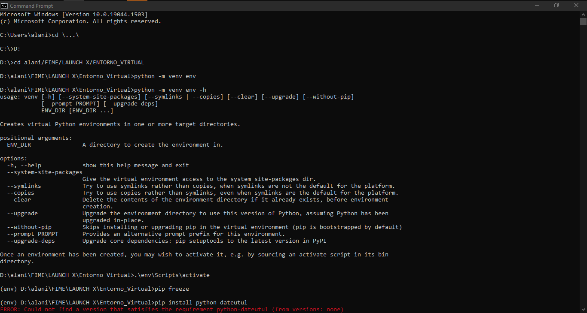
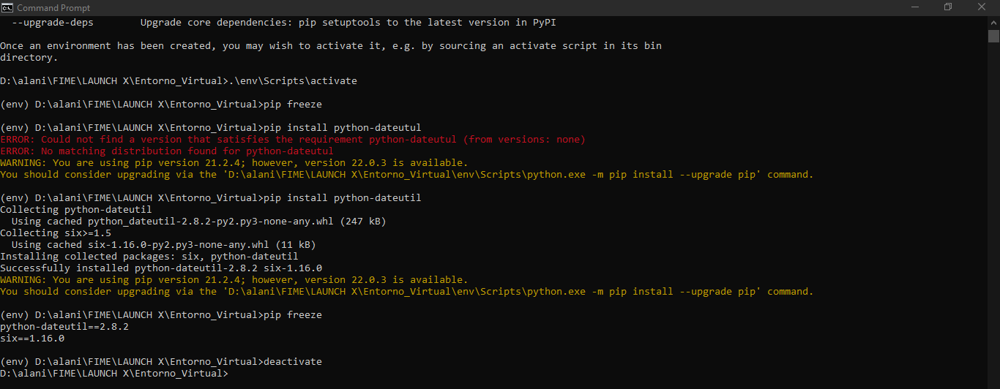

# Creación de un entorno virtual en python

1. Primero entramos al fichero (archivo donde se crearan las carpetas del entorno) desde el cmd moviendonos con "cd \...\" para salir de las carpetas y "cd carpeta/carpeta" para entrar a las carpetas.

2. Segundo creamos la carpeta del entorno virtual cona el comando:
```python -m venv env```

3. Tercero creamos nuestro entorno virtual con el comando:
```python -m venv env -h```

4. Cuarto activamos nuestro entorno con el comando:
```.\env\Scripts\activate```

5. Quinto checamos las bibliotecas instalas con el comando:
```pip freeze```

6. Sexto instalamos una biblioteca con el comando:
```pip install python-dateutil```

7. Séptimo nuevamente checamos las bibliotecas instaladas con el comando:
```pip freeze```

8. Octavo desactivamos el entorno virtual con el comando:
```deactivate```


